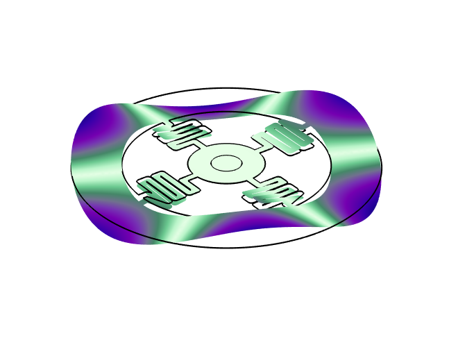

# py_eigensim
<br />
<div align="center">
    
  </a>
</div>

This repository contains python scripts to automate the generation of GDS files for microdisks, loading the GDS files into COMSOL, performing the simulation, and saving the results to a specified directory. 

## Installation

The scripts were tested on a Windows 10 computer, in a `python 3.9.6` environment. User are highly recommended to use [Miniconda](https://docs.conda.io/en/latest/miniconda.html) to create their `python` environment. To ensure that all the scripts work as intended, we recommend installing all the packages listed in `requirements.txt`, by entering the following command in the anaconda prompt
```
$ conda create --name <env> --file requirements.txt
```

For user's who would like to use their existing `python` environment, the specialized package `MPh` should be installed. This package interfaces with COMSOL. 

## Quick start 

Head to [`disk.ipynb`](disk.ipynb) to try out the code. 

## References

- [MPh documentation](https://mph.readthedocs.io/en/stable/)